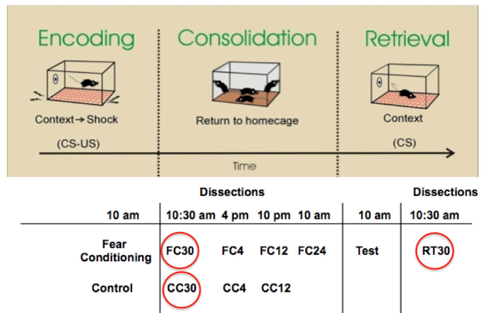
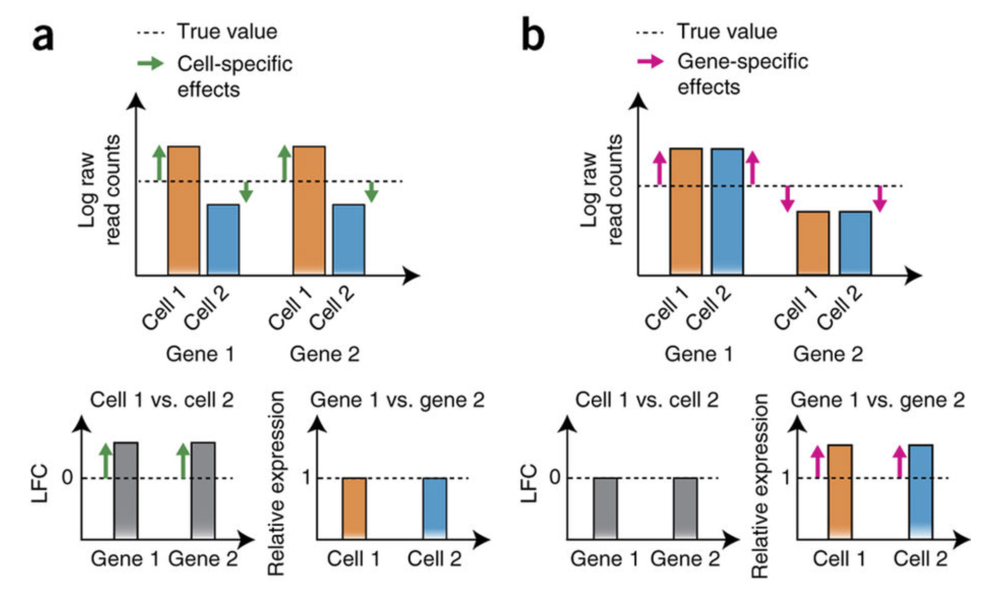
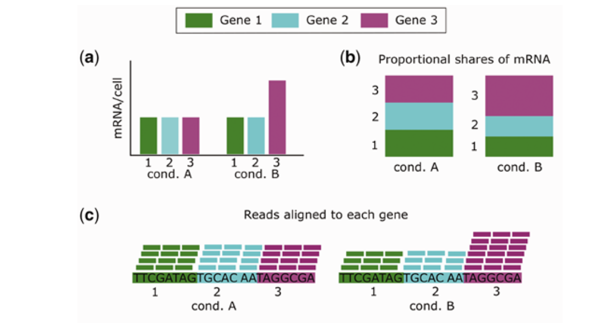
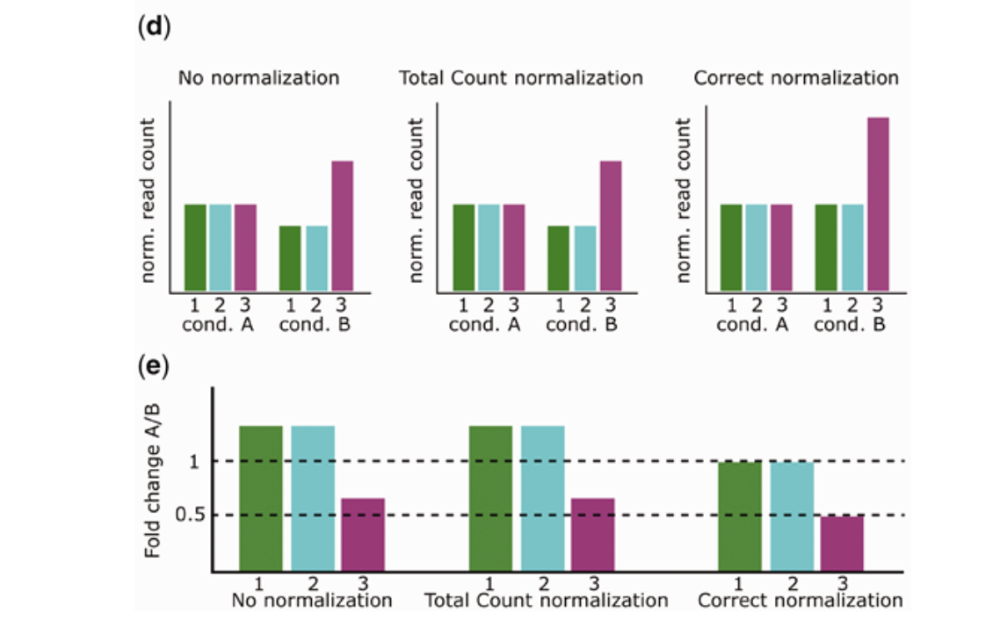
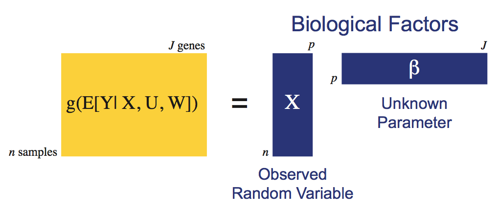
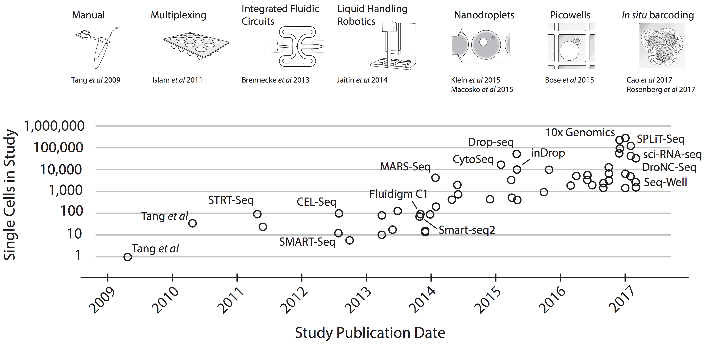
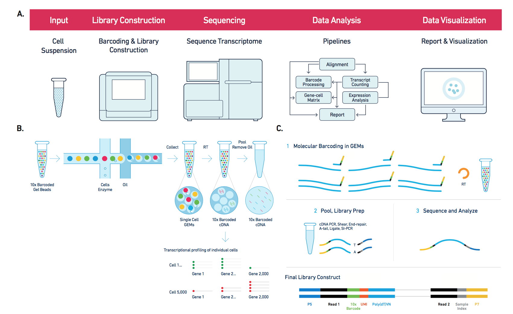
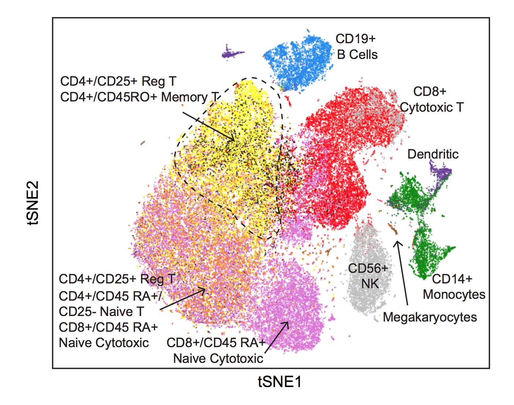
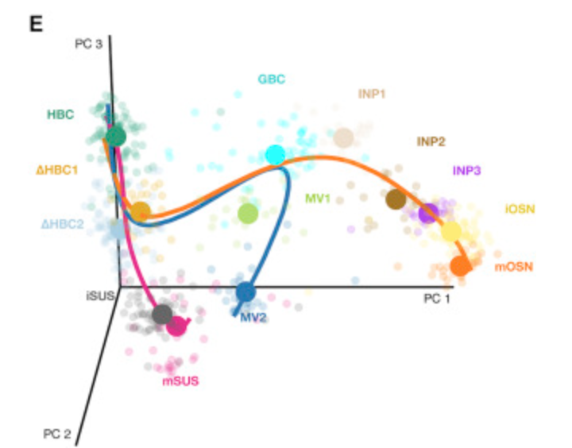

# Introduction

```{r options, include=FALSE}
knitr::opts_chunk$set(cache=TRUE, error=FALSE, message=FALSE, warning=FALSE, echo=FALSE, results="markup")
library(RColorBrewer)
library(EDASeq)
library(DESeq2)
library(RUVSeq)
library(edgeR)
```

## What we will cover

I will give you a _brief_ introduction to the _statistical analysis of RNA-seq_.

We will focus on differential expression analysis using _R/Bioconductor_.

We will start from a _matrix of gene-level read counts_.

We will cover the two most popular packages, `DESeq2` and `edgeR`.

I will also show you how to deal with unwanted variation using the `RUVSeq` package.

## What we will not cover

I will not show you the R code, but _focus on the statistical concepts_.

The R code that I used for the plots in these slides is available online at [https://github.com/drisso/canazei](github.com/drisso/canazei).

Only in Bioconductor, there are 150 packages for QC/EDA, 69 for normalization, and 241 for differential expression! 

Hence, this is not a comprehensive account on how to perform these steps, but rather an _introduction to the statistical methods_ behind some of them.

## Useful links

- These slides: [https://github.com/drisso/canazei](github.com/drisso/canazei)
- Example dataset: [https://github.com/drisso/peixoto2015_tutorial](github.com/drisso/peixoto2015_tutorial)

- The edgeR user guide [https://bioconductor.org/packages/edgeR](bioconductor.org/packages/edgeR)
- The DESeq2 vignette  [https://bioconductor.org/packages/DESeq2](bioconductor.org/packages/DESeq2)
- The F1000 Research Bioconductor gateway [https://f1000research.com/gateways/bioconductor](f1000research.com/gateways/bioconductor)
- Bioconductor support forum [https://support.bioconductor.org](support.bioconductor.org)

## Contact me!

Email: `dar2062@med.cornell.edu`

Github: [https://github.com/drisso](github.com/drisso)

Twitter: `@drisso1893`

## Gene-level read counts

\scriptsize
```{r, echo=FALSE, results='markup'}
data_dir <- "~/git/peixoto2015_tutorial/Peixoto_Input_for_Additional_file_1/"
fc <- read.table(paste0(data_dir, "Peixoto_CC_FC_RT.txt"), row.names=1, header=TRUE)
negControls <- read.table(paste0(data_dir, "Peixoto_NegativeControls.txt"), sep='\t', header=TRUE, as.is=TRUE)
positive <- read.table(paste0(data_dir, "Peixoto_positive_controls.txt"), as.is=TRUE, sep='\t', header=TRUE)

x <- x_orig <- as.factor(rep(c("CC", "FC", "RT"), each=5))
names(x) <- names(x_orig) <- colnames(fc)

filter <- apply(fc, 1, function(x) length(x[which(x>10)])>5)
filtered <- filtered_orig <- as.matrix(fc)[filter,]
head(filtered)
```

## An example dataset



## An example dataset

- C57BL/6J adult male mice (2 months of age). 
- Five animals per group: fear conditioning (FC), memory retrieval (RT), and controls (CC).
- Illumina 100bp paired-end reads mapped to the mouse genome (mm9) using GMAP/GSNAP.
- Ensembl (release 65) gene counts obtained using HTSeq.

\source{Peixoto et al. (2015). NAR.}

# Exploratory Data Analysis

```{r}
negCon <- intersect(negControls[,2], rownames(filtered))
FCup <- intersect(positive[positive[,3]=="UP",1], rownames(filtered))
FCdown <- intersect(positive[positive[,3]=="DOWN",1], rownames(filtered))
RTup <- intersect(positive[positive[,4]=="UP",1], rownames(filtered))
RTdown <- intersect(positive[positive[,4]=="DOWN",1], rownames(filtered))

colors <- brewer.pal(9, "Set1")
colLib <- colors[x]
```

## Exploratory Data Analysis (EDA)

\centering
\includegraphics[width=\linewidth]{pie_chart}

## Exploratory Data Analysis (EDA)

\centering
\includegraphics[width=.8\linewidth]{fuck_grapefruit}

\source{http://xkcd.com/242/}

## Exploratory Data Analysis (EDA)

_Key step_ of any data analysis and of statistical practice in general.

Examine dataset to 

- get a _"first impression"_ of the data
- reveal expected and _unexpected_ characteristics of the data.
- reveal _outlying observations_
- check plausibility of the _assumptions_

## EDA of Gene Expression Data

We will cover two important graphical summaries of the data, extremely useful for EDA.

- Relative Log Expression (RLE) plots
- Principal Component Analysis (PCA)

<!-- ## Boxplots -->

<!-- The boxplot, also called _box-and-whisker plot_ was first introduced by Tukey in 1977 as a graphical summary of a variable's distribution. -->

<!-- It is a graphical representation of the median, upper and lower quartile, and the range (possibly, with outliers). -->

<!-- ## Boxplots -->

<!-- ```{r, echo=FALSE} -->
<!-- ex <- c(rnorm(100), c(-4, 5)) -->
<!-- boxplot(ex) -->
<!-- ``` -->

<!-- ## Boxplot -->

<!-- - The bold line represents the _median_. -->
<!-- - The upper and lower sides of the box represent the lower and upper quartiles, respectively. -->
<!-- - The central box represents the _inter-quartile range_ (IQR). -->
<!-- - The whiskers represent the range of the variable, but any point more than 1.5 IQR above the upper quartile (or below the lower quartile) are plotted individually as _outliers_. -->
<!-- - Comparing the distances between the quartiles and the median gives indication of the symmetry of the distribution. -->

<!-- ## Quantiles -->

<!-- The median, upper-quartile, and lower-quartile are examples of _quantiles_. -->

<!-- More formally, the $f$ _quantile_ or $f\times 100$th _percentile_ of a distribution is the smallest number $q$ such that at least $f \times 100$\% of the observations are less than or equal to $q$. -->

<!-- In other words, $f\times 100$\% of the area under the histogram is to the left of the $f$ quantile. -->

<!-- _Quartiles._ -->
<!-- \begin{tabular}{ll} -->
<!-- \emph{First/lower quartile} & 0.25 quantile\\ -->
<!-- \emph{Second quartile/median} & 0.50 quantile\\ -->
<!-- \emph{Third/upper quartile} & 0.75 quantile -->
<!-- \end{tabular} -->

<!-- ## Linear vs Log Scale -->

<!-- Because gene expression data have a skewed distribution, we prefer to transform the data using the logarithm (usually $log_2$) _for visualization and exploration_. -->

<!-- To avoid problems with zero values, it is common to add a small constant (usually 1) before the transformation ($log(x+1)$). -->

<!-- ## Example: Boxplot of log-counts -->

<!-- ```{r} -->
<!-- boxplot(log(filtered+1), col=colLib) -->
<!-- ``` -->

## Relative Log Expression (RLE)

For each gene

1. Compute the _median_ count _across all samples_.
2. Take the _log-ratio_ of the read count to the median.
3. _Visualize_ the distribution across all genes.

Comparable samples should have _similar RLE distributions_ centered around zero.

## Example: RLE plots

```{r}
plotRLE(filtered, outline=FALSE, col=colLib)
```

## Dimensionality Reduction

Number of genes (variables): $J \approx 20{,}000$.

Number of samples (sample size): $n \ll J$.

_Dimensionality reduction_: representing the data using _fewer than_ $J$ variables.

Useful for _summarizing_ and _visualizing_ the data.

<!-- A variety of often related approaches can be used; here, we focus on _Principal component analysis_ (PCA). -->

<!-- replaces the original variables by fewer _orthogonal linear combinations_ of these variables, with successively _maximal variance_. -->

## Principal Component Analysis (PCA)

Principal components are _linear combinations_ of the original variables, that are

- _orthogonal_ and 
- have successively _maximal variance_.

Such linear combinations seek to "separate out" the observations, while loosing as little information as possible.

## Example: PCA

```{r}
plotPCA(filtered, labels=FALSE, col=colLib, pch=19, cex=2)
legend("bottomright", levels(x), fill=colors, cex=2)
```

# Normalization

## Sequencing and systematic biases

RNA-seq experiments are _inherently stochastic_: reads are _randomly sampled_ from a pool of amplified cDNA molecules.

Our interest: the expression level of each gene.

More specifically: the _relative abundance_ of mRNA molecules for a gene within the population of mRNA molecules in each sample.

## Sequencing and systematic biases

Several experimental sources of systematic biases affect measurements of gene expression.

We need to _normalize_ the data for gene- and sample-specific biases. 

## Gene- and Sample-specific effects



\source{Vallejos et al. (2017). Nature Methods}

## Normalization

We distinguish between two types of normalization:

- _within-sample normalization_ removes gene-specific biases (e.g., due to GC-content)
- _between-sample normalization_ adjusts for effects related to distribu- tional differences in read counts between samples.

## Between-sample normalization

The simplest approach is to simply _divide each count by the total number of reads in the sample_.

This is sometimes called _total count normalization_ and is employed in popular summaries such as _FPKM_ and _TPM_.

## Between-sample normalization



\source{Evans et al. (2017). Briefings in Bioinformatics.}

## Between-sample normalization



\source{Evans et al. (2017). Briefings in Bioinformatics.}

## Between-sample normalization

In the context of differential expression, two approaches are the most popular and have been demonstrated to work well in practice.

_Geometric mean scaling_. Default in the _DESeq2_ package.

_Trimmed Mean of M-values_ (TMM). Default in the _edgeR_ package.

Both approaches compute _normalization factors_ by comparing the samples to a _reference sample_.

Normalization factors are then adjusted to multiply to 1.

## Geometric mean scaling

Reference sample: the geometric mean of all samples.

Normalization factors are computed by the _median ratio_ of each sample to the reference sample.

## TMM

Reference sample: the sample whose upper quartile is closest to the mean upper quartile.

Normalization factors are computed by the _weighted mean log-ratio_ of each sample to the reference sample, after trimming away genes with extreme log-ratios.

## Example: normalization factors

```{r}
tmm <- calcNormFactors(filtered, method="TMM")
deseq <- calcNormFactors(filtered, method="RLE")
plot(tmm, deseq, col=colLib, pch=19, xlab="TMM", ylab="Geo Mean", cex=1.5)
abline(0, 1)
```

## Evaluating effectiveness of normalization

```{r}
norm <- betweenLaneNormalization(filtered, which="upper")
plotRLE(norm, outline=FALSE, col=colLib)
```

## Evaluating effectiveness of normalization

```{r}
plotPCA(norm, labels=TRUE, col=colLib, cex=1.5)
```

## Evaluating effectiveness of normalization

Even after normalization, the distribution of the RLE and the PCA are not great.

From the PCA we see that experiments carried out at day 3 and 8 are not quite like the others.

We may decide to exclude these samples from the analysis.

## Evaluating effectiveness of normalization

```{r}
idx <- grep("[3,8]", colnames(fc), invert = TRUE)
filter <- apply(fc[, idx], 1, function(x) length(x[which(x>10)])>5)
filtered <- as.matrix(fc)[filter, idx]

x <- as.factor(rep(c("CC", "FC", "RT"), each=3))
names(x) <- colnames(filtered)
colLib <- colors[x]
norm <- betweenLaneNormalization(filtered, which="upper")

plotRLE(norm, col=colLib, outline=FALSE)
```

## Evaluating effectiveness of normalization

```{r}
plotPCA(norm, labels=TRUE, col=colLib, cex=1.5)
```

# Differential Expression

## Differential Expression (DE)

Goal: Find genes which are _significantly different_ between the conditions.

What do we mean by _significantly_ different?

Statistical significance can be evaluated using _hypothesis testing_.

For simplicity, let's assume for now that we want to compare two groups.

## Statistical tests of hypothesis

Hypothesis testing is a formal statistical procedure in which we test which of _two mutually exclusive hypotheses are true_.

Importantly, the two hypotheses are not treated equally, but each has a different role.

The _null hypothesis_, $H_0$, represents the \textit{status quo}, or the expected result that we want to accept as true if the data provides no convincing evidence against it.

The _alternative hypothesis_, $H_1$, is a statement about an effect that we want to prove.

## Hypothesis testing in RNA-seq

In RNA-seq, we want to simultaneously test tens of thousands of hypotheses (one for each gene).

For each gene, the hypotheses are:

- $H_0$: the gene is expressed at the same level in both groups.
- $H_1$: the gene is _differentially expressed_ between the two groups.

## Assumptions

Needed in any statistical model.

We need to assume a _data generating distribution_.

For instance, if we assume that the data are distributed as a Gaussian random variable, we can use _linear regression models_ and _t-tests_.

## Nature of RNA-seq data

For each gene, we _count_ how many reads can be mapped to a particular sequence.

The Gaussian distribution is a very general model to describe _continuous data_.

Since we have counts, we will need an alternative distribution.

<!-- ## The Poisson Model -->

<!-- \centering -->
<!-- \includegraphics[width=.7\linewidth]{Simeon_Poisson} -->

<!-- Simeon Poisson (1781 -- 1840).  -->

## The Poisson Model

The Poisson distribution naturally arises from binomial calculations, with a large number of trials and a small probability.

However, it has a rather stringent assumption: **the variance is equal to the mean**!

$$
Var(Y_{ij}) = \mu_{ij}
$$

In real datasets the variance is greater than the mean, a condition known as **overdispersion**.

## A real example

```{r, echo=FALSE, message=FALSE, warning=FALSE}
y <- DGEList(counts = filtered, group = x)
y <- calcNormFactors(y)
design <- model.matrix(~x)
y <- estimateDisp(y, design)
meanVarPlot <- plotMeanVar(y, 
                           show.raw.vars=TRUE, 
                           show.tagwise.vars=FALSE,
                           show.binned.common.disp.vars=FALSE,
                           show.ave.raw.vars=FALSE, 
                           NBline = TRUE , nbins = 100,
                           pch = 16, 
                           xlab ="Mean Expression (Log10 Scale)", 
                           ylab = "Variance (Log10 Scale)" , 
                           main = "Mean-Variance Plot" )
```

## The Negative Binomial Model

A generalization of the Poisson model is the negative binomial, that assumes that the variance is a quadratic function of the mean.

$$
Var(Y_{ij}) = \mu_{ij} + \phi_j \mu_{ij}^2
$$
where $\phi$ is called the **dispersion parameter**.

Both `edgeR` and `DESeq2` assume that the data is distributed as a negative binomial.

## The Negative Binomial Model

If we want to use the negative binomial model to fit our data, we need to _estimate_ two parameters:

- The dispersion parameter $\phi_j$
- And the mean $\mu_{ij}$

After estimating $\phi_j$, we can use a _generalized linear model_ (GLM) to estimate the mean and test for the difference between the groups.

## Generalized Linear Models

GLMs are a generalization of linear models for distributions other than the Gaussian.

For the negative binomial distribution, GLMs take the form of a _log-linear model_, where we model the log of the mean as a linear function of the _covariates_.

## Generalized Linear Models



## How to specify the design matrix

The matrix $X$ is called _design matrix_ and it includes

- An _intercept_ (a vector of ones) that captures the overall mean
- The _biological factors_ that we want to test
- Possibly, _confounding factors_ that we need to account for in the analysis

In the simplest case of _two group comparison_, X is simply an indicator variable of the group to be compared.

When we have more than two groups, we need more than one indicator.

## Example: two group comparison

```{r}
xx <- droplevels(x[c(1:6)])
mat <- model.matrix(~xx)
colnames(mat) <- c("Intercept", "Group2")
as.data.frame(mat)
```

## Example: three group comparison

```{r}
mat <- model.matrix(~x)
colnames(mat) <- c("Intercept", "FC", "RT")
as.data.frame(mat)
```

<!-- ## Interpreting the parameters -->

<!-- In addition to the design matrix $X$, we have a matrix of parameters $\beta$, that we need to estimate from the data. -->

<!-- These parameters tells us how the genes are expressed between the groups. -->

<!-- We will see how to interpret the parameters in a two-group comparison for simplicity, but things are analogous with multiple groups. -->

## Interpreting the parameters

Back to the two-group case.

```{r}
mat <- model.matrix(~xx)
colnames(mat) <- c("Intercept", "Group2")
as.data.frame(mat)
```

For each gene, the $\beta$ parameter has two components $\beta = [\beta_0 \, \beta_1]$.

## Interpreting the parameters

For a sample in Group 1
$$
\log E[Y_{ij} | X = 0] = \beta_0.
$$

For a sample in Group 2
$$
\log E[Y_{ij} | X = 1] = \beta_0 + \beta_1
$$

Hence,
$$
\beta_1 = \log \frac{E[Y_{ij} | X = 1]}{E[Y_{ij} | X = 0]}
$$
<!-- \begin{align*} -->
<!-- \log \frac{E[Y_{ij} | X = 1]}{E[Y_{ij} | X = 0]} &= \log E[Y_{ij} | X = 1] - \log E[Y_{ij} | X = 0] \\ -->
<!-- &= \beta_0 + \beta_1 - \beta_0 = \beta_1. -->
<!-- \end{align*} -->

## Interpreting the parameters

$\beta_1$: _average log-fold-change between the two groups_.

When more than three groups: each $\beta$ is the _average log-fold-change_ with respect to the _reference group_.

## Example: interpreting the parameters

```{r}
y <- DGEList(counts = filtered, group = x)
y <- calcNormFactors(y)
design <- model.matrix(~x)
colnames(design) <- c("Intercept", "FC", "RT")
y <- estimateDisp(y, design)
fit <- glmFit(y, design)
lrt <- glmLRT(fit, coef=2:3)
topTags(lrt)[,1:2]
```

## Test for differential expression

For each gene, our test for differential expression involves the following hypotheses.

- $H_0$: $\beta_1 = 0$;
- $H_1$: $\beta_1 \neq 0$.

We can test these hypotheses by using a

- _Likelihood Ratio Test_ (default in `edgeR`);
- _Wald Test_ (default in `DESeq2`).

If the p-value is less than $\alpha = 0.05$ we _reject the null hypothesis_, hence declaring the gene _differentially expressed_.

## Testing error

Even if the null hypothesis is true, our test can still reject it.

This is called _type I error_, i.e., to reject the null hypothesis when it is true.

## Adjusting for multiple testing

Suppose that $\alpha = 0.05$, and that the null hypothesis is indeed true (no DE genes). 

With two tests (genes): the probability of finding at least one (false) positive result is $1 - 0.95^2 \approx 0.1$.

With 20 genes: $1 - 0.95^{20} \approx 0.64$. 

That means that we have $64\%$ probability to find at least one DE gene when there are none! 

We are testing thousands of genes!

## Adjusting for multiple testing

_Multiple testing procedures_ can be used to _adjust the p-values_ for multiplicity.

Here, we briefly cover the _Benjamini-Hochberg procedure_ to control the _False Discovery Rate_ (FDR).

## The False Discovery Rate

The False Discovery Rate (FDR) is defined as the _expected proportion of false discoveries_ amongst the rejected null hypotheses.

In terms of gene expression, this means the expected proportion of non-DE genes wrongly declared as DE.

We usually want to limit this proportion to $5\%$ or $10\%$.

## Example: FDR control

```{r}
set.seed(123)
x0 <- runif(20)      #p-values of 10 true null hypotheses. They are Unif[0,1] distributed.
x1 <- rbeta(5,2,30)  # 5 false hypotheses, rather small p-values
xx <- c(x1,x0)
cols <- c(rep(2, 5), rep(1, 20))
plot(sort(xx), pch=19, col=cols[order(xx)], xlab="Rank", ylab="p-value", main="Sorted p-values for 25 genes", cex=1.5)
```

## Example: FDR control

```{r}
plot(sort(xx), pch=19, col=cols[order(xx)], xlab="Rank", ylab="p-value", main="Sorted p-values for 25 genes", cex=1.5)
lines(c(1,25), c(1/25 * 0.5 ,0.5), type="l", col="purple", lwd=3)
```

## Example: FDR control

```{r}
plot(sort(xx), pch=19, col=cols[order(xx)], xlab="Rank", ylab="p-value", main="Sorted p-values for 25 genes", cex=1.5)
lines(c(1,25), c(1/25 * 0.5 ,0.5), type="l", col="purple", lwd=3)
lines(c(1,25), c(1/25 * 0.9 ,0.9), type="l", col="blue", lwd=3)
legend("topleft", paste0("FDR = ", c(0.5, 0.9)), lty=1, lwd=3, col=c("purple", "blue"))
```

<!-- ## Example: Differentially Expressed Genes -->

<!-- \tiny -->

<!-- ```{r} -->
<!-- topTags(lrt) -->
<!-- ``` -->

## Example: Differentially Expressed Genes

```{r}
dds <- DESeqDataSetFromMatrix(countData = filtered,
                              colData = data.frame(Condition = x,
                                                   Expt = substring(colnames(filtered), 3)),
                              design = ~ Condition)
dds <- DESeq(dds)
res <- results(dds)
summary(res)
```

## Volcano plots

```{r}
top <- topTags(lrt, n = Inf)$table
de <- rownames(top)[top$FDR <= 0.05]
plot(top$logFC.FC, -log10(top$PValue), pch=19, col="grey", cex=1.5,
     xlab = "logFC: FC vs CC", ylab = "-log10(p-value)")
points(top[de, "logFC.FC"], -log10(top[de, "PValue"]), pch=19, cex=1.5,
       col=2)
```

<!-- ## Heatmaps -->

<!-- ```{r} -->
<!-- library(pheatmap) -->
<!-- pheatmap(log1p(norm[de[1:100],]), annotation_col = data.frame(group=x), -->
<!--          show_rownames = FALSE) -->
<!-- ``` -->

## Diagnostics: the p-value histogram

To see if the model that we used correctly fit the data, we can check the distribution of the (unadjusted) p-values.

We know from theory that if all the genes are non-DE the distribution of the p-values should be uniform.

For the DE genes, we expect p-values very close to 0.

Hence, we expect to see a mixture of a uniform distribution and a "spike" at zero.

Non-uniform distributions are an indication of batch effects or other _unwanted variation_ that affects the data.

## Example of "good" p-value distribution

```{r}
hist(top$PValue, xlab="p-value", main="Histogram of p-values")
```

## Example of "bad" p-value distribution

```{r}
y <- DGEList(counts = filtered_orig, group = x_orig)
y <- calcNormFactors(y)
design <- model.matrix(~x_orig)
colnames(design) <- c("Intercept", "FC", "RT")
y <- estimateDisp(y, design)
fit <- glmFit(y, design)
lrt <- glmLRT(fit, coef=2:3)
top_orig <- topTags(lrt, n = Inf)$table
hist(top_orig$PValue, xlab="p-value", main="Histogram of p-values")
```

# Batch Effects

## Accounting for batch effects

As for any high-throughput genomic technology, RNA-seq is affected by complex, non-linear effects that are not removed by global scaling normalization.

These effects are collectively known as _batch effects_.

## Accounting for known batch effects

Sometimes, we know (or suspect) where these effects come from.

For instance, we might have processed the samples in different days, or at a different time of day.

In large collaborative studies, samples might be processed in different labs.

Or we may have used different machines, or protocols.

In these cases, it might be enough to include the appropriate variable in the design matrix to adjust for these _known_ effects.

## Accounting for unknown batch effects

More often, we do not have a clear idea of which aspect of the data generation introduced the batch effects.

Or it may be a combination of too many factors to all include in the model.

In such cases, we can estimate such effects from the data.

One way to do so is by using the _Remove Unwanted Variation_ (RUV) approach, which uses _negative control genes_ to estimate batch effects from the data.

This approach is implemented in the Bioconductor package `RUVSeq`.

## Example of unwanted variation

```{r}
norm <- betweenLaneNormalization(filtered_orig, which="upper")
plotRLE(norm, outline=FALSE, col=colLib)
```

## Example of unwanted variation

```{r}
plotPCA(norm, labels=TRUE, col=colLib, cex=1.5)
```

## Accounting for unwanted variation

Rather than filtering out the unusual samples, we can try to adjust (or normalize) their values using the expression levels of _negative control genes_.

The assumption is that we can identify a set of negative controls that are _not affected by biology_.

Hence, all the signal captured by these genes is _driven by unwanted variation_.

RUV estimates $k$ factors of unwanted variation that can be included in the design matrix for the DE analysis. In this case, we used $k=5$.

## Accounting for unwanted variation

```{r}
groups <- makeGroups(x)
ruv <- RUVg(norm, cIdx = negCon, k = 5)
plotRLE(ruv$normalizedCounts, outline=FALSE, col=colLib)
```

## Accounting for unwanted variation

```{r}
plotPCA(ruv$normalizedCounts, labels=TRUE, col=colLib, cex=1.5)
```

## Without batch correction

```{r}
hist(top_orig$PValue, xlab="p-value", main="Histogram of p-values")
```

## With batch correction

```{r}
y <- DGEList(counts = filtered_orig, group = x_orig)
y <- calcNormFactors(y)
design <- model.matrix(~x_orig + ruv$W)
colnames(design) <- c("Intercept", "FC", "RT", paste0("W", 1:5))
y <- estimateDisp(y, design)
fit <- glmFit(y, design)
lrt <- glmLRT(fit, coef=2)
top_ruv <- topTags(lrt, n = Inf)$table
hist(top_ruv$PValue, xlab="p-value", main="Histogram of p-values")
```

# Single-Cell RNA-seq

## Single-Cell RNA-seq



\source{Svensson et al. (2017). arXiv.}

## 10X Genomics



\source{10xgenomics.com}

## Cell type discovery



\source{Zheng et al. (2017). Nature Communications.}

## Stem cell differentiation



\source{Fletcher et al. (2017). Cell Stem Cell.}

## Computational challenges

_The Human Cell Atlas_: cellular map of the human body (expected millions of cells).

_The BRAIN Initiative_: 250k mouse neurons.

$$
250{,}000 \times 20{,}000 \approx 40 \, \text{GB}
$$

## Methodological challenges

- _Define/Discover molecular cell types_

\begin{flushright}
\textit{Bacher and Kendziorski (2016). Genome Biology.}
\end{flushright}

- _Normalization_

\begin{flushright}
\textit{Vallejos et al. (2017). Nature Methods.}
\end{flushright}

- _Identify marker genes_

\begin{flushright}
\textit{Van den Berge et al. (2018). bioRxiv.}
\end{flushright}

- _High-level analysis_

\begin{flushright}
\textit{Wagner et al. (2016). Nature Biotechnology.}
\end{flushright}


## Thank you for your attention!

_Email_: \url{dar2062@med.cornell.edu}

_Slides and code_: \url{github.com/drisso/canazei}
